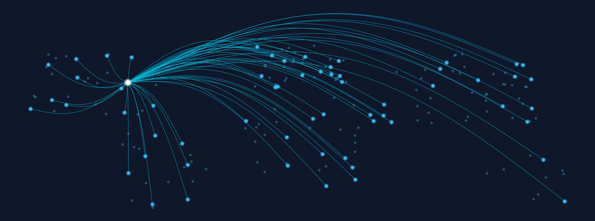

  <strong>Home</strong> | 
  <a href="dataset.html">Dataset Versions</a> | 
  <a href="data_visualizations.html">Visualizations</a> | 
  <a href="methodology.html">Methodology</a> | 
  <a href="papers.html">Publications</a>

# ****THIS PAGE IS UNDER CONSTRUCTION*****

# U.S. Aid to Security Sector Actors (USASSA) Dataset

Welcome to the official repository for the **USASSA Dataset**. This project provides a systematic, global tracking of unclassified U.S. security assistance from 2000 through May 2026. Developed via a collaboration between academic researchers and the Security Assistance Monitor (SAM), the dataset consolidates qualitative line-item notifications into mutually exclusive, exhaustive typologies of aid type and recipient type.

## Overview
As security assistance becomes an increasingly critical component of foreign policy, the need for detailed, comprehensive data is paramount. The USASSA dataset bridges the gap between raw government disbursement logs and rigorous academic analysis.

*   **Geographic Scope:** 192 United Nations member states.
*   **Temporal Coverage:** 2000 to 2026.
*   **Granularity:** Disaggregates security assistance into 14 functional aid types (e.g., material support, military training, security sector reform) and 8 recipient types (e.g., ground forces, police, civil authorities).

## Citation
If you use this dataset in your research, please cite the foundational paper:

> Sullivan, P., Rincon Alvarez, G., & Marx, N. (2024). Building Partner Capacity: US Aid to Security Sector Actors. *Journal of Conflict Resolution*. [https://doi.org/10.1177/00220027241276156](https://doi.org/10.1177/00220027241276156)

## Contact
For data inquiries or corrections, please open an issue in this repository or contact the authors directly., N. (2024). Building Partner Capacity: US Aid to Security Sector Actors. *Journal of Conflict Resolution*. [https://doi.org/10.1177/00220027241276156](https://doi.org/10.1177/00220027241276156)

## Contact
For data inquiries or corrections, please open an issue in this repository or contact the authors directly.
